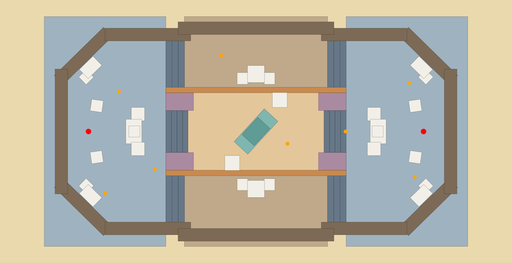

# Map reconstruction notes

The arena is rebuilt in 3D from the supplied top-down reference image (1852 × 952 px). It is authored **in the image's
pixel space** and converted to metres (`1 px = 0.026 m`, so the playable hall is ≈ 36 m × 17 m; `src/shared/map.ts`).
Because the layout is symmetric, most pieces are authored once and mirrored. The renderer, the collision world, the
server's shot validation and the minimap all read the *same* box list, so they can never disagree.

## What was preserved

| Feature in the image | In the game |
|---|---|
| Octagonal hall, sandy stone walls with blue trim, pilasters, recessed panels | Perimeter walls are 5.2 m, with plinth, blue trim band + dentils, cornice, pilasters and inset panels (decor only, no extra collision) |
| Two large opposing side courtyards (blue-grey pavers) | Left / right courtyards, level 0, 4 m–9 m wide, one spawn each, mirrored |
| Big pale rectangles on the long side walls | 7.4 m glazed doors set into the left/right walls |
| Central rectangular area with the angled parked car | Sunken sandy pit (−0.9 m) with a 4.2 m pale-teal car rotated ≈ −47° |
| Parallel horizontal structures bordering the centre | Two 2.4 m rim walls with ochre-painted pit faces and blue caps |
| Stairs at the middle of the left/right ends | 5-step stairs (0.18 m risers) down into the pit, 4 m gate |
| Stairs at the four corners of the centre | 4-step stairs (0.18 m risers) up into the top/bottom lanes |
| Mauve / blue-grey blocks beside the stairs | 2.4 m kiosk masses with mauve (left) / blue-grey (right) roofs |
| Crate stacks | Courtyard 3-crate clusters, tall lane stacks (2.6 m centre + two 1.3 m wings), pit crates (point-symmetric), corner stacks, spawn cover |
| Corner cover | Stepped crate pairs against each of the four 45° corners |
| Domes outside the top/bottom walls | Four blue-tiled domes on drums just outside the walls (decor) |

## Assumptions (the image has no height / passage information)

1. **Height scale from perspective.** The photo is a perspective shot from above: wall faces fan outward by a factor that
   depends on height. Using the ~1.2× stretch of the perimeter wall as 5 m, the crates come out at ≈ 1.4 m and the pit rim
   at ≈ 2.4 m. Those are the heights used.
2. **Three lanes.** Top lane, bottom lane (both raised 0.72 m, entered by stairs from each courtyard) and the middle pit
   (sunken 0.9 m, entered through the 4 m stair gates). The rim walls between lane and pit are full-height so each lane is
   a separate route: **three ways to reach the opponent**, plus weaving around the courtyard crates.
3. **Nothing is climbable except stairs.** Step height is 0.5 m and a jump rises 0.77 m, so every crate (≥ 1.15 m) and the
   car are solid obstacles; there are no "crouch-jump onto crate" exploits and no places a player can get stuck.
4. **Gaps are either ≥ 0.9 m or sealed.** Cover pieces never leave a 0.3–0.7 m slot that could wedge the 0.6 m wide player.
5. **Fair spawns.** Spawns are exact mirror images (`x → −x`), 31.5 m apart on the centre line, each with the central crate
   cluster directly in front (6 m away) and spawn-cover crates beside them. The straight line between the spawns is blocked
   by the cluster, so nobody is exposed at round start. Sides alternate every round; the unit tests assert the mirroring.
6. **Sun.** Direction is fixed (SSW, 48° elevation). Shadows are real-time and symmetric enough not to favour a side; the
   wall shadows that fall across the left courtyard in the reference image are produced by this light.
7. **Open roof.** The hall has no ceiling, so sniping from lane to lane over the courtyards is possible (one long sightline
   at z ≈ ±7 m runs across the whole map; the middle pit has a second one just over the car).

## Verifying the layout

`scripts/mapsvg.ts` renders the collision boxes as an SVG in the reference image's pixel space; unit tests check symmetry,
spawn placement, stair walkability, solidity of crates/walls/car, and that bullets cannot pass through them.
